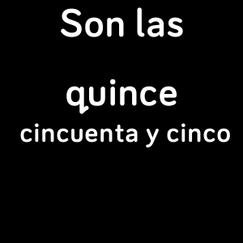

# ¿Que hora es? 

> Fitbit's Versa compatible clockface which tells time in Spanish.

Features
- Spells time in Spanish (mas o menos correct)
- Optionally spells day of the week (likely wrong)

## Motivation

For all Spanish lovers here from the fellow language dabbler. This is a way for me to learn by heart how to tell the time in Spanish. I hope you will find this useful as well.

If you found this project useful and there anything that you feel is not right, than your help is highly appreciated for the sake of the good and proper grammar

## Changelog

v1.2.0
 - moved clockface to monorepo
 - added optional day of the week spelling
 - quite a refactor to support shareability of the code
 - extracting hardcoded strings into separate file
