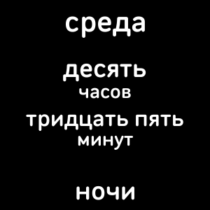
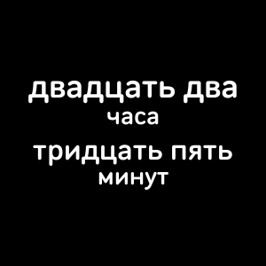

# Сколько время?

> Fitbit's Versa compatible clockface which tells time in Russian.

Features
- Spells time in Russian
- Optionally spells day of the week

## Motivation

For all Russian lovers here from the native speaker. You can trust me on this one, or almost trust...

If you found this project useful and there is anything that you feel is not right, please let me know for the sake of the good and proper grammar.

## Changelog

v1.0.0
- Initial release
